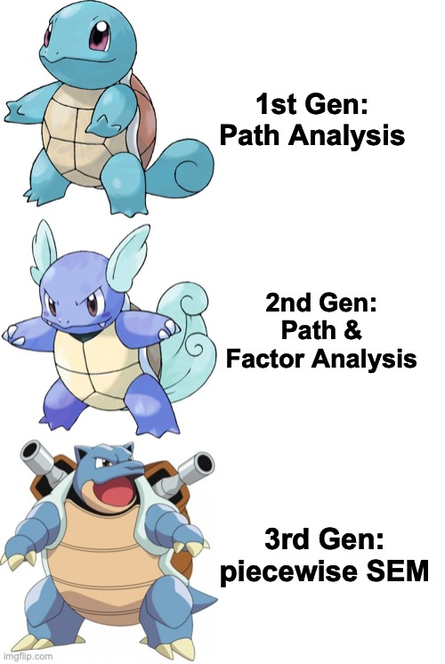

```{r setup, include=FALSE}
knitr::opts_chunk$set(echo = TRUE)
```

```{r include=FALSE}
rm(list=ls())
```

```{r include=FALSE, message=FALSE}
library(tidyverse)
```


{width="50%"}

## 4.1 Getting the Basics: Complex Natural Systems, Causality and History

Ecologists frequently face the challenge of explaining complex natural systems. In such endeavors, linear regression alone becomes insufficient. **Structural Equation Modeling** (SEM) offers a valuable framework for analyzing complex, multivariate relationships in natural systems more effectively.

For example, Zhu et al. (2023) employed SEM to explore the effects of grazing cattle on the arthropod community in grassland ecosystems. They first developed a conceptual framework that outlines all the direct and indirect pathways between the large herbivores and the arthropod community (see Figure 4.1). Cattle can directly harm arthropods by trampling or unintentionally eating them. Additionally, they modify the vegetation and abiotic conditions of the environment, which indirectly influences arthropods by altering their habitat. These direct and indirect effects collectively reshape arthropod community structures, disrupt trophic interactions, and create cascading effects throughout the arthropod food web.

![**Figure 4.1: Conceptual map of the direct and indirect relationships between cattle and arthropod communities** This conceptual framework illustrates how cattle impacts arthropod communities and their food webs directly or through vegetation characteristics and abiotic conditions. The arrows represent the pathways. Cattle reduces plant quantity through defoliation. Plant quality and diversity may also change via selective feeding, altered soil nutrient cycling or shifted plant community composition. Grazing may reduce vegetation height and modify structural heterogeneity. Feeding and trampling can affect soil properties and microclimatic conditions. The large herbivores may increase the mortality rate of arthropods by unintentional predation and trampling. They introduce resources such as dung and their biomass. Grazers and arthropods may compete for resources such as plant biomass. The combined alteration of vegetation and abiotic factors and direct effects influence the abundance and biomass of arthropods in varying trophic guilds, thereby affecting food web interactions. The figure synthesises the frameworks of van Klink et al. (2015) and Zhu et al. (2023).](Figures_Memes/‎Figure_1.jpeg){width="90%"}

This example highlights the limitations of univariate regression ($y = a + bx + \epsilon$). Conventional univariate analyses do not allow for incorporating multiple dependent variables, nor can variables function simultaneously as predictors and responses. In the case of grassland ecosystems, grazing cattle affect several dependent variables, including vegetation characteristics, microclimate, and arthropod populations. Furthermore, vegetation acts both as a response and as a predictor, mediating the indirect effects of cattle on the arthropod community. These cascading effects cannot be accurately captured using univariate methods. In contrast, SEM provide a framework for representing and analyzing multivariate, interacting systems.

SEM

:   are probabilistic multivariate models designed to test and evaluate pre-assumed networks of causal relationships. They rely on the principles of regression analysis. The causal networks are visually described in path diagrams whose pathways can be expressed mathematically through a series of equations (Figure 4.2).

This chapter begins by exploring a fundamental concept of SEM: causality. Following this, a historical overview provides insights into the evolution of SEM and the ongoing shifts in its definition. The next section of the chapter delves into the statistical methodologies used in SEM, covering path diagrams, traditional SEM, and the more contemporary piecewise SEM framework. A case study illustrates the application of the piecewise SEM framework in R using the *piecewiseSEM* package. The chapter concludes with an overview of advanced techniques, practical recommendations for application, and common pitfalls to avoid. Finally, you can apply what you have learned through an exercise.

### 4.1.1 Exploring Causation

{width="70%"}

The previous definition highlighted that SEM is designed to test and evaluate pre-assumed networks of **causal** relationships. In contrast, traditional modeling approaches often emphasize that "*correlation does not imply causality.*" This subchapter examines the ways in which the SEM framework diverges from traditional approaches in terms of the concept of causation.

Most prominently, SEM distinguishes itself by not relying on null hypothesis testing, a framework commonly used in many scientific disciplines. In this traditional approach, the first step is formulating a null hypothesis, which typically assumes no difference between groups. This null hypothesis is then compared to an alternative hypothesis, stating that the groups differ in their mean.

In contrast, the initial step within the SEM framework involves creating a theory-based model that outlines a network of causal links, such as the direct and indirect effects of cattle on arthropod communities (see Figure 4.1). After developing the model, it is tested by comparing the observed data to the expected outcomes derived from the model. The entire model is rejected if the data does not align with the theoretical assumptions. In other words, this process involves comparing a theoretical causal network to the observed data, whereas traditional modeling compares a null hypothesis against an alternative hypothesis.

This approach to testing and evaluating a model, constructed on a solid foundation of prior knowledge and evidence, enables the inference of causation. SEM identifies statistical dependencies, subject to causal interpretation based on supporting evidence and theoretical frameworks. In other words, it is not the statistical results that determine causation. It is your informed interpretation of these outcomes that provides the causal insights.

In summary, SEM starts by constructing a pre-assumed model grounded in your extensive knowledge of the system. This emphasis on a theory-based framework allows for the inference of causal relationships.

### 4.1.2 The Evolution of Structural Equation Models

Throughout its history, SEM has continually evolved, with ongoing advancements expanding its application across various scientific fields. The origin of SEM dates back to the early 20th century, and its evolution can be categorized into three distinct generations.

The first generation traces back to Sewall Wright's development of Path Analysis, a multivariate approach that accounts for multiple causes and responses. Path analysis employs a graphical representation of the model (see Figure 4.2). The pathways connecting causes and responses can be quantified through path coefficients. Through his work, Wright laid the groundwork for causal inference, providing essential insights into model building and interpretation.

A significant advancement in the modern formulation of SEM occurred in the early 1970s when Karl Jöreskog integrated Path Analysis and Factor Analysis within the LISREL (Linear Structural Relations) model. This pivotal innovation marked the beginning of the second-generation SEM. One of Jöreskog's most notable contributions was incorporating the maximum likelihood approach. Maximum likelihood methods improved the assessment of overall model fit by analyzing covariances (refer to Chapter 4.2.2 for more details). Remember that SEM starts by formulating a theory-based causal model that is tested against empirical data. Consequently, the evaluation of overall model fit is essential.

The third generation of SEM is characterized by several noteworthy advancements. This chapter primarily focuses on piecewise SEM, an approach that no longer depends on maximum likelihood methods and covariance analysis. Piecewise SEM addresses some of the most significant limitations of second-generation SEM, enabling the simultaneous incorporation of non-normal distributions, random effects, and various sampling designs. The subsequent subchapter will further explore the differences between second-generation SEM and piecewise SEM.

{width="35%"}

#### Revised Definition: SEM as Models for Observed Variables

Over the past century, the definition of SEM has evolved continuously. However, some prevailing definitions, particularly in the social sciences where SEM has been more commonly applied, may not be well-suited for ecological research of natural systems. It is crucial to be aware of these varying definitions, as they can influence the interpretation and application of SEM in different disciplines.

In social sciences, SEM is a framework for analyzing the relationship between observed and latent variables. This definition is closely associated with second-generation SEM, which synthesizes Path Analysis with Factor Analysis. In contrast, ecological research primarily focuses on observed variables. According to the prevailing definition in social sciences, the analysis of observed variables falls within the framework of Path Analysis. However, it is necessary to acknowledge that modern Path Analysis has evolved alongside SEM, integrating advanced techniques such as maximum likelihood estimation. These techniques were not utilized in historical Path Analysis. Consequently, contemporary Path Analysis can be viewed as a specialized case of SEM, reflecting a more developed approach to examining relationships among observed variables.

The concept of SEM expanded further with the introduction of third-generation piecewise SEM. Often referred to as Confirmatory Path Analysis, piecewise SEM was initially designed to exclusively include observed variables. This methodology enhanced the applicability of SEM, as it does not rely on covariance analysis through maximum likelihood estimation, thus offering greater flexibility in accommodating the specific data structures often encountered in ecological research. Consequently, in ecology, it may be more appropriate to describe SEM as a multivariate approach to regression.

Box 1: Factor Analysis and Latent Variables Factor Analysis involves the construction of latent (unmeasured) variables by estimating their value based on multiple observed variables. While the concept may be unfamiliar to you as a scientist, social scientists and psychologists utilize latent variables to quantify abstract constructs that are difficult to measure directly. For example, your motivation to continue reading cannot be measured directly. However, we can infer it through measurable variables such as the number of pages you've read today, the readability score of the text, and your academic background in statistics. [There is Confirmatory and Exploratory Factor Analysis]


### Box 1: Factor Analysis and Latent Variables
Factor Analysis involves the construction of latent (unmeasured) variables by estimating their value based on multiple observed variables. While the concept may be unfamiliar to you as a scientist, social scientists and psychologists utilize latent variables to quantify abstract constructs that are difficult to measure directly. For example, your motivation to continue reading cannot be measured directly. However, we can infer it through measurable variables such as the number of pages you've read today, the readability score of the text, and your academic background in statistics.

### Glossary

**Structural Equation Models** 
: are probabilistic multivariate models designed to test and evaluate pre-assumed networks of causal relationships. They can include observed and latent variables.

**Path Analysis** 
: are multivariate models that test and evaluate the causal relationship between multiple independent and dependent observed variables. *Path Analysis* can be considered a special case of *Structural Equation Models*. 

**Factor Analysis** 
: are models that involve the construction of latent variables by estimating their value based on multiple observed variables. 

**Observed variables** 
: are variables that can be measured directly through surveys, experiments or other means. 

**Latent variables** 
: are variables that represent abstract concepts or traits that cannot be measured directly. They are not recorded within your data frame. They are inferred (constructed) from the observed variables.

**Exogenous variables** 
: are variables that are not influenced by other variables within the model. They are only predictor variables.

**Endogenous variables**
: are variables that are influenced by other variables within the model. They are response variables that may also serve as predictor of other variables.

