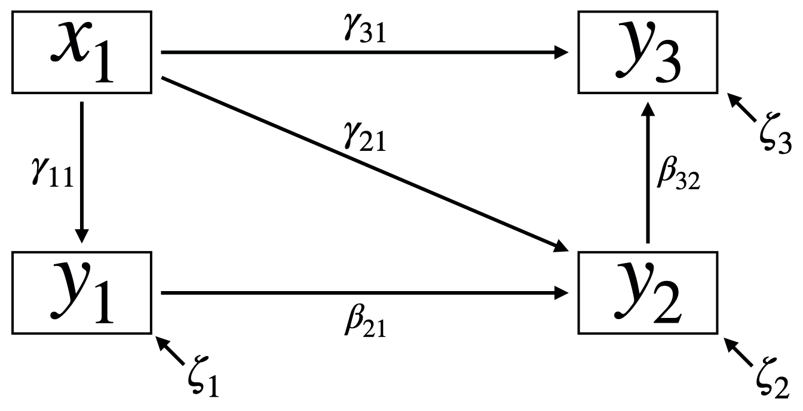
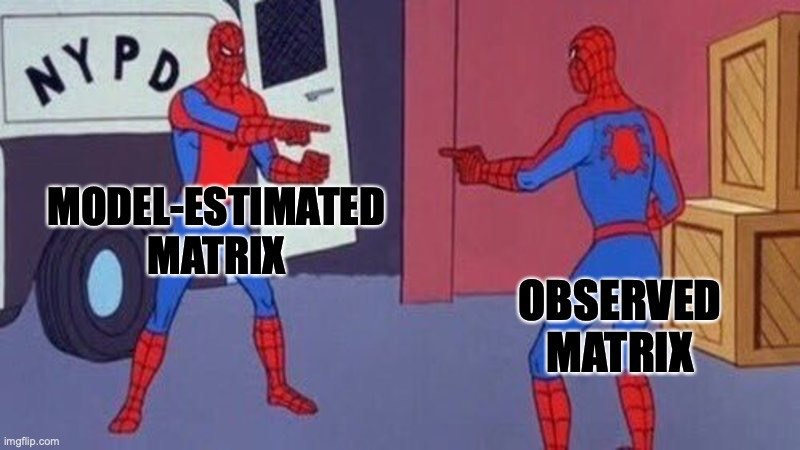
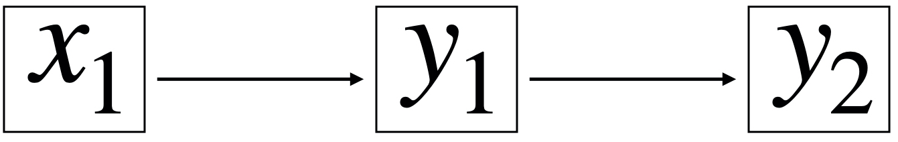

---
output:
  pdf_document:
    latex_engine: xelatex
documentclass: book
mainfont: Arial
monospace: Courier New
linestretch: 1.5
fontsize: 12pt
geometry:
- top=1in
- bottom=1in
- left=1in
- right=1in
---

```{r setup, include=FALSE}
knitr::opts_chunk$set(echo = TRUE)
```

```{r include=FALSE}
rm(list=ls())
```

```{r include=FALSE, message=FALSE}
library(tidyverse)
```

# 4.2 Getting a Little Technical: The Statistical Approach of SEM

## 4.2.1 The Core of SEM: Path diagrams and Structural Equations

{width="70%"}

The path diagram in Figure 4.2 serves as a visual representation of an example Structural Equation Model. In this diagram, the boxes represent the observed variables, while the arrows between the boxes indicate the directed causal relationship between them. In the context of SEM, $x$-values are refer to exogenous variables because these are not dependent on any variable in the model. In other words, arrows only point away and never towards exogenous variables. Endogenous variables, on the other hand, are explained by variables within the model and are depicted as $y$-values. Speaking in the sense of path diagrams, they always have arrows pointing at them, while they can also emit arrows. In this example, we have one exogenous and three endogenous variables. Notice that different symbols denote the path coefficients associated with the arrows. Gamma ($\gamma$) represents the effect of an exogenous variable on an endogenous variable, while beta ($\beta$) symbolizes the influence of an endogenous variable on another. The index of the coefficient indicates the two variables that the arrow connects. For example, in the notation $\beta_{21}$, the first number (2) indicates that the arrow points to the response variable $y_2$, while the second number (1) shows that the arrow originates from the predictor variable $y_1$. The zeta ($\zeta$) symbols correspond to error terms for the endogenous variables. The error term captures unknown or unspecified influences on the response variables, such as random measurement errors and unaccounted causal effects.

In addition to the visual representation, a series of equations can also describe the SEM of Figure 4.2:

$$
y_1=\alpha_1 +\gamma_{11}x_1+\zeta_1
$$ $$
y_2=\alpha_2 + \gamma_{21}x_1 + \beta_{21}y_1 +\zeta_2
$$ $$
y_3=\alpha_3+\gamma_{31}x_1+\beta_{32}y_2+\zeta_3
$$

These equations share similar components to linear functions. The term alpha ($\alpha$) represents the intercept. The path coefficients ($\gamma$ and $\beta$) correspond to the regression coefficients, indicating the function's slope and describing the relationship between the predictor and the response variable. Meanwhile, zeta ($\zeta$) denotes the error term (residuals).

## 4.2.2 Techniques of Traditional SEM

The historical overview of SEM presented in subchapter 4.1.2 introduced key terms such as covariance analysis and maximum likelihood approach, which are fundamental concepts in second-generation SEM. This section aims to provide a general understanding of these traditional SEM techniques.

Traditional SEM is fundamentally grounded in analyzing covariances, similar to how ANOVA analyzes variances. While variance quantifies the spread in a set of values around their mean, covariance assesses the extent to which two random variables co-vary, revealing the direction and strength of their relationship. In other words, if the response variable closely follows the changes in the predictor variable, large covariation will indicate a strong relationship between the two.

The variances for $x$ and $y$ are calculated as:

$$
VAR_x=\frac{\sum(x_i - \overline{x})^2}{n-1}
$$ $$
VAR_y=\frac{\sum(y_i - \overline{y})^2}{n-1}
$$

where $x_i$ and $y_i$ are the values of every individual sample, $\overline{x}$ and $\overline{y}$ are the sample means, and $n$ is the sample size. The covariance between $x$ and $y$ is calculated as:

$$
COV_{xy}=\frac{\sum(x_i - \overline{x})(y_i - \overline{y})}{n-1}
$$

Fortunately, you can obtain the variances and covariances in R through a **variance-covariance matrix**. The diagonal of this matrix contains the variances of the variables: the variance of $x_1$ is found in the top left cell, the variance of $y_1$ is in the middle cell, and the variance of $y_2$ is in the bottom right cell. The upper and lower triangles of the matrix represent the covariances between the variables.

Creating a variance-covariance matrix of three variables in R:

```{r variance-covariance ma}
set.seed(122) # Set the random seed for reproducibility

data <- tibble(x1 = runif(100)) %>% # Create tibble with random values for x1
  mutate(y1 = x1 + runif(100)) %>% # random values for y1
  mutate(y2 = y1 + runif(100)) # random values for y2

cov(data) # get the variance-covariance matrix for data
```

The covariance values relate to the path coefficients, such as the $\gamma$ and $\beta$ of Figure 4.2. In other words, the path coefficients, which quantify the relationship between two variables, can be derived from the variance-covariance matrix. However, it becomes challenging to calculate all parameters when dealing with complex systems involving indirect (or partial) effects. Therefore, computer programs apply the maximum likelihood approach for coefficient estimation. Consider the variance-covariance matrix of your observed data. The objective is to identify the coefficient values that produce an variance-covariance matrix that closely resembles the observed one. The maximum likelihood estimation method systematically explores the parameter space while refining the parameters to minimize the discrepancy between the estimated and the observed variance-covariance matrices.

{width="70%"}

Once the iterative process is complete, maximum likelihood estimation provides both the path coefficients and an $F_{ML}$ value. A high $F_{ML}$ value indicates a significant discrepancy between the observed and the estimated variance-covariance matrices, while a low value suggests a good fit. Moreover, the $F_{ML}$ follows a $\chi ^2$-distributions, allowing for the overall model fit to be assessed using the $\chi ^2$ statistic. A p-value greater than 0.05 indicates a good fit, allowing you to accept the model. (Remember that in SEM, the priority is not given to a null hypothesis but to a pre-assumed model.) Conversely, if the p-value is less than 0.05, it suggests that your estimated model does not adequately fit the observed data, necessitating its rejection. Given that the $\chi ^2$ test is sensitive to sample size, you should also use other goodness-of-fit measures. Furthermore, you can use the AIC and BIC values to compare different models.

Before delving into the statistical techniques of piecewise SEM, it is necessary to address the assumptions and limitations of traditional SEM. First, SEM utilizing the maximum likelihood approach assumes multivariate normality, continuous variables, and linear relationships. In other words, you can only use *lm-functions* when applying traditional SEM. Additionally, traditional SEM requires a relatively large sample size. While the maximum likelihood method facilitates the simultaneous estimation of path coefficients—often called **global estimation**—this approach can be somewhat rigid. In contrast, the **local estimation** provided by piecewise SEM offers the flexibility needed for analyzing ecological data.

The statistical background of traditional SEM is included here, even though the focus is on piecewise SEM, to provide foundational knowledge for understanding SEM. While not all introduced concepts are necessary for grasping piecewise SEM, familiarity with these ideas will be advantageous when exploring SEM literature or reviewing papers on piecewise SEM. Consequently, the concepts are presented to help you better comprehend future readings. Additionally, if you are interested in traditional SEM, the *lavaan* package in R is a valuable resource.

## 4.2.3 Model Identifiability

Model identifiability refers to whether each model parameter can be uniquely estimated.

Let us use a metaphor for understanding model identifiability. Consider a puzzle with four identical pieces. You can arrange these pieces in 24 different ways. Thus, there is no unique solution. In this case, the puzzle is under-identified because you have too little information to find the correct placement of the four pieces. Now, imagine a standard puzzle in which each piece has a distinct pattern. In this scenario, there is only one unique way to solve it. This version of the puzzle is just-identified since it provides just the information you need to solve it. Finally, envision a standard puzzle with pieces that have additional numbers on the back to indicate their positions. In this case, the puzzle is over-identified because you possess more information than necessary to solve the puzzle.

Similarly, you will need enough information within your model to solve the unknown parameters. In other words, your model needs to be just- or over-identified. You can use the **t-rule** to determine identifiability:

$$
t ≤ \frac{n(n+1)}2
$$

In this equation, t is the number of unknowns while n is the number of known information.

{width="50%"}

For example, Figure 4.3 shows a path diagram with three observed variables. These are the pieces of known information (n=3). We want to calculate the three variances of each variable and the three covariances to estimate the three path coefficients between the variables. Thus, we have six unknowns (t=6).

$$
6 ≤ \frac{3(3+1)}2
$$ $$
6 ≤ 6
$$

In this case, the model is just-identified since there is just enough information to estimate the parameters (6=6). The difference between the right and the left side of the equation corresponds to the model's degrees of freedom and the independence claims, which you will learn about in the section on piecewise SEM (see 4.2.4). In the current example, the right side equals the left side. Thus, there are no degrees of freedom and no independence claims.

## 4.2.4 Techniques of Piecewiese SEM

In the section on traditional SEM, you learned about **global estimation**, involving the *simultaneous* assessment of the relationships among all variables in a dataset by reproducing the variance-covariance matrix. **Local estimation**, on the other hand, solves every equation *separately* by fitting a regression model for every endogenous variable. Metaphorically, local estimation involves building your LEGO castle step by step, carefully assembling each part. In contrast, global estimation is shaking the package until a fully-formed castle emerges.

Remember the equations that describe Figure 4.2:

$$
y_1=\alpha_1 +\gamma_{11}x_1+\zeta_1
$$ $$
y_2=\alpha_2 + \gamma_{21}x_1 + \beta_{21}y_1 +\zeta_2
$$ $$
y_3=\alpha_3+\gamma_{31}x_1+\beta_{32}y_2+\zeta_3
$$

There are three response variables in this analysis. In piecewise SEM, you solve the equations sequentially. First, you estimate the parameters for the equation that predicts $y_1$. In the next step, you use the fitted values, or predictions of $y_1$ as inputs for the equation that calculates $y_2$. You continue this process, moving from $y_2$ to $y_3$ while comparing the fitted values against the observed values throughout the iterative process. As you experiment with different parameter combinations, you aim to find a combination that minimizes the discrepancy between your fitted values and the observed values for each response variable. Fortunately, computer programs like R, combined with the *piecewiseSEM* package, perform all the calculations for you.

Bill Shipley proposed this process of local estimation, also called piecewise SEM, in 2000. This framework provides greater flexibility in implementing non-normal distributions, accommodating random effects, and fitting smaller datasets. In addition to LMs, piecewise SEM supports various models like GLMs, GLMMs, GAMs, and GAMMs. However, it is necessary to acknowledge that piecewise SEM has its own set of assumptions and limitations. First, the data must satisfy the assumptions of the individual models, including heteroscedasticity, independence of errors, and the absence of outliers (see Chapters 1 & 2). Second, piecewise SEM operates under the assumption of recursive or acyclic relationships. In other words, it does not support feedback loops.

Piecewise SEM requires alternative goodness-of-fit measures since no global variance-covariance matrix is available for comparison with the observed data. Shipley's test of directed separation is the most common method for this purpose. Simply put, the test evaluates whether you have missed any significant pathways between variables in your original model. When there is no pathway between two variables, you are essentially making an independence claim. The total number of these independence claims equals the degrees of freedom you determined by applying the t-rule as discussed previously. For instance, refer to the path diagram in Figure 4.3, where all variables are connected. In this case, the model is just-identified, resulting in zero degrees of freedom and zero independence claims. In contrast, there is no direct connection between $x_1$ and $y_2$ in Figure 4.4​. Here, the model is over-identified, providing one degree of freedom and translating into a single independence claim regarding the missing relationship between $x_1$ and $y_2$.

{width="50%"}

The test of directed separation translates this independence claim into an equation, which is then solved to determine whether the path coefficient is significantly different from zero (p \< 0.05). If the path coefficient is not significantly different from zero (p \> 0.05), you specified the original model correctly and there is no relationship between between $x_1$ and $y_2$.

Lastly, the p-values for each independence claim are used to compute Fisher's C statistic, which measures how well the model fits the data. Fisher's C follows a $\chi ^2$ distribution, allowing the use of the $\chi ^2$-table to calculate a p-value for assessing the goodness-of-fit. A high p-value (p \> 0.05) suggests that the proposed model adequately fits the data and can be accepted.

In summary, piecewise SEM estimates the path coefficients by solving every structural equation individually. The test of directed separation assesses the overall model fit by determining the validity of each independence claims and assessing whether unconnected variables are indeed unrelated.
